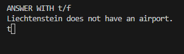
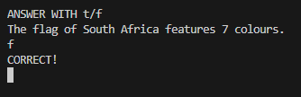
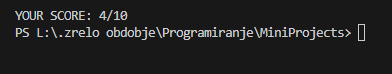

# QnAGame

Cmd-based QnA game that uses [openTrivia API](https://opentdb.com/api_config.php) to get questions and anwsers. My first experience using APIs in Java.

## DEPENDECIES

- [gson](https://github.com/google/gson)

## EXAMPLE PHOTOS
\
\
